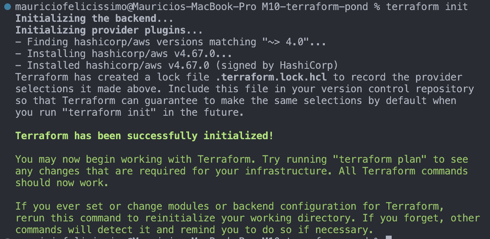
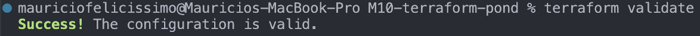
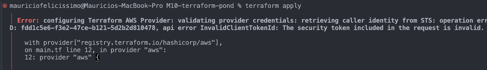

# M10-terraform-pond

Aqui vou mostrar como segui o tutorial de terraform e AWS da Semana 9

## Instalações
Primeiro instalei terraform usando homebrew no terminal do Mac
```
brew tap hashicorp/tap
brew install hashicorp/tap/terraform
```
Depois instalei AWS CLI no browser normal

## Credenciais
Usei a terminal do AWS CLI para encontrar as minhas credencias AWS usando:
```
cat ~/.aws/credentials
```
Depois configurei essas credencias pra poder usar terraform com aws
```
aws configure

AWS Access Key ID [None]: "segredo"
AWS Secret Access Key [None]: "segredo tmb"
Default region name [None]: 
Default output format [None]: 
```

## Criação do repositorio
Criei uma pasta "M10-terraform-pond" e nela criei um arquivo main.tf

Main.tf:
```
terraform {
  required_providers {
    aws = {
      source  = "hashicorp/aws"
      version = "~> 4.16"
    }
  }

  required_version = ">= 1.2.0"
}

provider "aws" {
  region  = "us-west-2"
}

resource "aws_instance" "app_server" {
  ami           = "ami-830c94e3"
  instance_type = "t2.micro"

  tags = {
    Name = "ExampleAppServerInstance"
  }
}
```
## Iniciei o terraform


## Formatei
```
terraform fmt
```

## Validei


## Criação Infra
Apliquei a configuração utilizando o comando:
```
terraform apply
```
Deu erro:


## Professor...
Tentei de tudo mas nao to conseguindo conectar as minhas credenciais. De resto ta tudo funcionando. Realmente não sei o que esta acontecendo. 

Alem de procurar as credenciais no terminal da AWS, tambem procurei no terminal normal com 'nano ~/.aws/credentials' que me retornou a access key e secret acces key (que eram identicas alias). Tentei usar essas tambem e nao deu certo. 

Pesquisei muito na internet de como achar meus access keys ou criar novos mas nao estou achando no console do aws como fazer isso. Teoricamente ia dar o comando:
```
terraform apply
```
e aí ia ver no aws a instancia da EC2 rodando.

Depois daria:
```
terraform destroy
``` 
que acabaria com isso. 

Me desculpa, realmente não sei o que aconteceu mas vou continuar tentando.